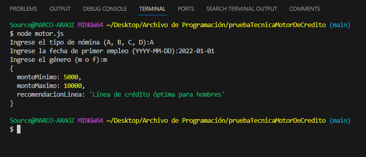
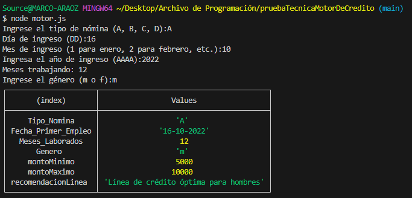

# MotorDeDecisionDeCredito
## Node Version -V 18.18.0
## Packages
"prompt-sync" (para ejecutar prompts en la consola)

Este código en JavaScript se encarga de calcular una serie de valores para recomendar una "Línea de crédito óptima" para un individuo. 

Aquí hay una explicación paso a paso de lo que hace el código:

## Se creo un archivo js: motor.js

Se define una función llamada calculoMotor que toma tres argumentos: tipoNomina, fechaPrimerEmpleo, y genero. Estos argumentos son opcionales, lo que significa que el código puede solicitar al usuario que los ingrese si no se proporcionan.

Si tipoNomina no se proporciona (es nulo o indefinido), el código solicitará al usuario que ingrese el tipo de nómina (A, B, C, o D).

Si fechaPrimerEmpleo no se proporciona (también nulo o indefinido), el código calcula la cantidad de meses que el individuo ha trabajado desde su fecha de ingreso. Esto se hace mediante una función llamada calcularMesesTrabajando, que toma el día, el mes y el año de ingreso como entrada y calcula la diferencia en meses entre la fecha actual y la fecha de ingreso.

Si genero no se proporciona, el código solicita al usuario que ingrese su género (m o f).

Luego, el código determina valores de montoMinimo y montoMaximo según el valor de tipoNomina. Dependiendo del tipo de nómina (A, B, C, o D), se asignan diferentes rangos de montos mínimos y máximos.

La variable recomendacionLinea se establece en función del género. Si el género es "m" (masculino), la recomendación es para hombres. Si es "f" (femenino), la recomendación es para mujeres. En cualquier otro caso, se establece como "Línea de crédito no determinada".

Se crea un objeto llamado resultado que contiene los siguientes campos:

Tipo_Nomina: el tipo de nómina ingresado.
Fecha_Primer_Empleo: la fecha de ingreso formateada como "DD-MM-AAAA".
Meses_Laborados: la cantidad de meses trabajados.
Genero: el género ingresado.
montoMinimo y montoMaximo: los valores calculados en función del tipo de nómina.
recomendacionLinea: la recomendación de la línea de crédito.
Finalmente, se devuelve el objeto resultado.

Se llama a la función calculoMotor sin argumentos para ejecutarla y se almacena el resultado en la variable resultado. Luego, se muestra la información contenida en resultado en una tabla utilizando console.table.

## Presentación de resultados

