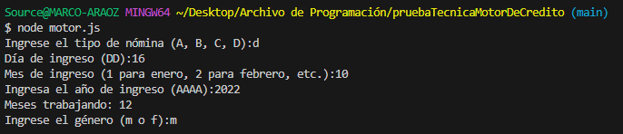

# MotorDeDecisionDeCredito
## Node Version -V 18.18.0
## Packages
"prompt-sync" (para ejecutar prompts en la consola)

## Se creo un archivo js: motor.js

Se definió una función de Javascript llamada 'calculoMotor' que tiene como parámetros de entrada: 
tipoNomina (string), valor en {A, B, C, D}
fechaPrimerEmpleo (Date),
genero (string).

Dentro de la función se tienen las variables con prompts:
tipoNomina (valor en {A, B, C, D}),
fechaPrimerEmpleo (valor tipo Date),
genero (valor en {m, f}).
 
Dentro de la función se definen las variables montoMinimo, montoMaximo, recomendacionLinea

monto minimo:
if (tipoNomina === "A" && fechaPrimerEmpleo) {
montoMinimo = 1000;
montoMaximo = 5000;
}

La salida de la función será un objeto que contenga los atributos: montoMinimo, montoMáximo y
recomendacionLinea los cuales deberán de contener el monto mínimo y máximo de crédito y la recomendación óptima de la línea de crédito respectivamente.

## Se creo un archivo js: mesesTabajando.js

Con la finalidad de resolver cuántos meses se llevaba laborando apartir del ingreso del empleado,
se desarrolló una función extra

## Presentación de resultados

